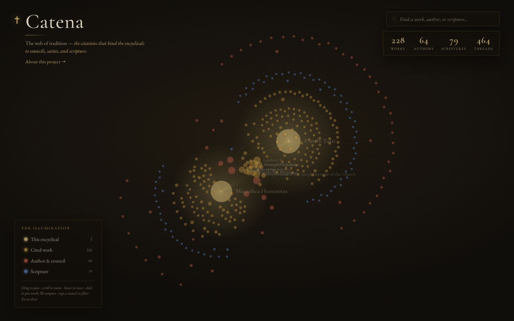

# Catena

**A visualization of the web of tradition** — the connected net of citations
within the papal encyclicals, and the councils, saints, and scripture they draw
upon.

> *Catena* — Latin for "chain"; a nod to the *Catena Aurea*, the "golden chain"
> of patristic citations compiled by Thomas Aquinas.

Every encyclical is woven from those before it. Leo XIV's *Magnifica Humanitas*
(2026) carries 224 footnotes citing prior encyclicals, ecumenical councils, the
writings of saints, and scripture. **Catena** catalogs those references and
renders them as an interactive, illuminated graph so the interconnectedness of
the Catholic intellectual tradition can be seen at a glance.



## How it works

A Python pipeline fetches and parses source documents into a deduplicated
citation graph, precomputes a force-directed layout, and emits a single static
JSON file. A dependency-free static site renders that JSON with a hand-written
HTML-canvas renderer — no graph library ships to the browser.

```
source HTML ──► fetch (cached) ──► parse ──► graph ──► layout ──► graph.json
 vatican.va                         │                              │
 papalencyclicals.net               │                              ▼
                                    │                         static site
                                    └─ scripture refs          (canvas renderer)
```

### Data model

| Node type   | Identity                                   | Pigment      |
|-------------|--------------------------------------------|--------------|
| `document`  | canonical vatican.va URL slug (language-independent), else `author+title` | gold |
| `author`    | normalized name (honorifics stripped)      | oxblood      |
| `scripture` | book + chapter:verse locator               | lapis        |

| Edge type         | Meaning                              |
|-------------------|--------------------------------------|
| `cites`           | a footnote reference, document → document |
| `authored_by`     | document → author                    |
| `cites_scripture` | document → biblical passage          |

The same work cited both with and without a URL (e.g. once as a bare title, once
as a hyperlink) is collapsed onto one node by normalized-title matching, and
`ibid.` footnotes inherit the work they refer to.

## Usage

Requires [uv](https://docs.astral.sh/uv/). Run `make` to list every task:

```bash
make build        # fetch → parse → build the graph (seed: Magnifica Humanitas)
make run          # serve the static site at http://localhost:8000  (PORT=8000)
make test         # run the test suite
make lint         # ruff (Python) + JS syntax check
make fmt          # auto-format Python
make check        # lint + test
make preview      # regenerate docs/preview.png from the live site (needs Chrome)
make clean        # remove caches and fetched HTML
```

`make build` writes `data/graph/graph.json` and copies it to `site/data/graph.json`.
`make run` rebuilds the graph automatically if it is missing. Serve on a different
port with `make run PORT=9000`.

In the site: drag to pan · scroll to zoom · hover to trace a work's connections ·
**click to pin a node** (click more to compare — the graph reveals the works that
bridge them) · click a pinned node again or its chip to remove it · `Esc` clears ·
type in the search box (or press `/`) to find any work, author, or scripture and
fly to it.

### Adding documents

Pass URLs to the builder (cached on first fetch), or edit the `SEEDS` list in
`pipeline/cli.py`:

```bash
uv run catena build \
  https://www.vatican.va/content/leo-xiv/en/encyclicals/documents/20260515-magnifica-humanitas.html \
  https://www.vatican.va/content/francesco/en/encyclicals/documents/papa-francesco_20201003_enciclica-fratelli-tutti.html
```

## Project layout

```
pipeline/
  fetch.py       polite, on-disk-cached HTTP fetching
  parse.py       Vatican HTML → structured document + citations
  scripture.py   biblical citation parsing (Catholic 73-book canon)
  normalize.py   author / type / document-identity normalization
  graph.py       parsed documents → deduplicated node/edge graph
  layout.py      force-directed layout precompute (networkx)
  cli.py         fetch / parse / build commands
site/
  index.html, styles.css, app.js   static, dependency-free canvas renderer
  data/graph.json                  build output consumed by the site
tests/           pytest suite for the pure parsing/graph logic
data/            raw cache (gitignored) + committed graph output
```

## Roadmap

- **Recursive crawl** — parse the works each encyclical cites, so the graph
  becomes a true multi-generational web rather than a handful of citation hubs.
- **papalencyclicals.net adapter** — a second parser for older documents not on
  vatican.va.
- **Graph analytics** — centrality, lineage tracing, era/author filters.
- **Per-document pages** — a static page per work with its citations in context.
- Deploy to Cloudflare on a custom domain.

## Sources

Primary texts: [vatican.va](https://www.vatican.va/) · archival fallback:
[papalencyclicals.net](https://www.papalencyclicals.net/). Fetches are cached and
rate-limited; this project links back to the original texts.
